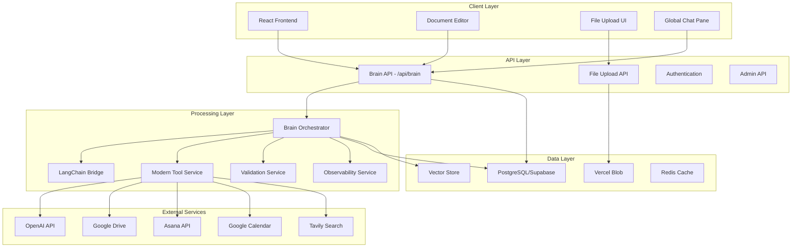
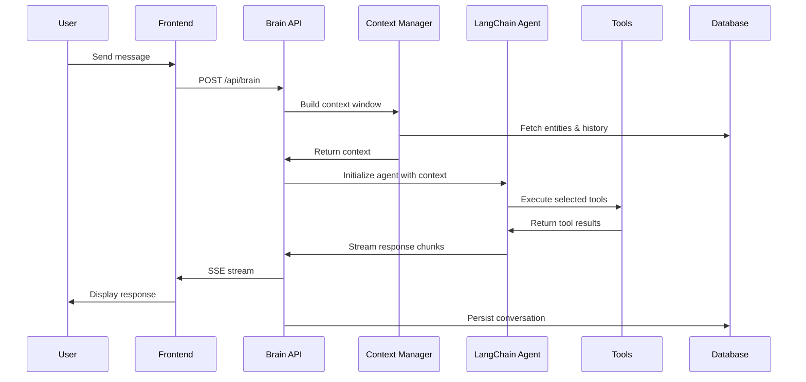
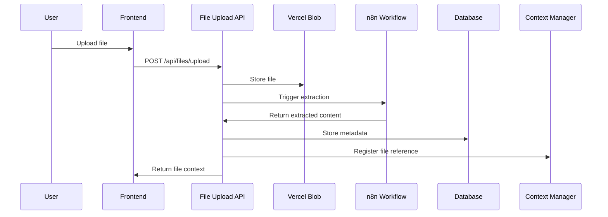

# Quibit RAG System Architecture

> Comprehensive overview of the Quibit RAG system architecture, design decisions, and component interactions

**Status**: Active  
**Last Updated**: 2025-06-02  
**Maintainer**: Quibit Development Team

## Table of Contents
- [Overview](#overview)
- [High-Level Architecture](#high-level-architecture)
- [Core Components](#core-components)
- [Data Flow](#data-flow)
- [Technology Stack](#technology-stack)
- [Design Decisions](#design-decisions)
- [Performance Considerations](#performance-considerations)
- [Security Architecture](#security-architecture)
- [Deployment Architecture](#deployment-architecture)

## Overview

Quibit RAG is a modular Retrieval-Augmented Generation (RAG) platform built on Next.js, LangChain, Vercel AI SDK, and a robust tool registry. The system is designed for scalability, maintainability, and extensibility, supporting multi-tenant deployments and real-time streaming.

### Key Architectural Principles
- **Modularity**: Self-contained components with clear interfaces
- **Scalability**: Horizontal scaling support with stateless design
- **Extensibility**: Plugin-based tool system and configurable prompts
- **Multi-tenancy**: Client-aware context and data isolation
- **Real-time**: Vercel AI SDK streaming responses and live updates
- **Type Safety**: Comprehensive TypeScript coverage

## High-Level Architecture

## Core Components

### 1. Brain API (`/app/api/brain/route.ts`)
**Purpose**: Central orchestration layer for all AI interactions

**Key Responsibilities**:
- Request authentication and validation
- LangChain agent initialization and execution
- Context window construction and management
- Tool selection and execution coordination
- Real-time SSE streaming to clients
- Message persistence and history management

**Integration Points**:
- Connects to all tools in the registry
- Interfaces with context management system
- Streams responses to frontend components
- Manages conversation state and persistence

### 2. Tool Registry (`/lib/ai/tools/`)
**Purpose**: Modular, self-contained tool implementations

**Key Features**:
- Direct API integrations (Google Drive, Supabase, Tavily)
- Client-specific configuration support
- Unified error handling and logging
- Dynamic tool selection based on context

**Available Tools**:
- `getFileContentsTool`: Google Drive document retrieval
- `searchInternalKnowledgeBase`: Vector database search
- `tavilySearch`: Web search capabilities
- `googleCalendar`: Calendar integration via n8n
- `createDocument`: Document artifact creation
- `queryDocumentRows`: Structured data queries

### 3. Context Manager (`/lib/context/`)
**Purpose**: Advanced conversation memory, entity tracking, and intelligent summarization

**Features**:
- Automatic entity extraction (addresses, dates, names)
- LLM-powered conversation summarization using GPT-4.1-mini
- Vector-based conversational memory storage and retrieval
- File reference tracking and metadata storage
- Cross-chat context sharing
- Background processing for performance optimization
- Cascade delete functionality for data consistency

### 4. Prompt System (`/lib/ai/prompts/`)
**Purpose**: Dynamic, client-aware prompt composition

**Components**:
- Orchestrator prompts for general AI interactions
- Specialist prompts for domain-specific contexts
- Tool usage instructions and examples
- Client-specific customizations and overrides

### 5. Streaming & Real-Time Updates
**Purpose**: Responsive user experience with live data

**Implementation**:
- Server-Sent Events (SSE) for chat streaming
- Real-time document editor synchronization
- Custom event types for different data streams
- Structured data streaming with type safety

## Data Flow

### 1. User Message Processing

### 2. File Processing Pipeline

## Technology Stack

### Frontend
- **Next.js 15.3.0**: React framework with App Router
- **TypeScript**: Type safety and developer experience
- **Tailwind CSS**: Utility-first styling
- **Radix UI**: Accessible component primitives
- **Framer Motion**: Animations and transitions

### Backend
- **Next.js API Routes**: Serverless API endpoints
- **LangChain 0.3.24**: AI agent orchestration
- **OpenAI GPT-4**: Language model integration
- **NextAuth**: Authentication and session management

### Data & Storage
- **PostgreSQL (Supabase)**: Primary database with vector support
- **Drizzle ORM**: Type-safe database operations
- **Vercel Blob**: File storage and CDN
- **Redis**: Caching and session storage (optional)

### External Integrations
- **Google Drive API**: Document retrieval and management
- **n8n**: Workflow automation and file processing
- **Tavily**: Web search capabilities
- **Asana**: Task and project management

## Design Decisions

### 1. Modular Tool Architecture
**Decision**: Implement tools as self-contained modules with unified interfaces

**Rationale**:
- Easy to add, remove, or update individual tools
- Clear separation of concerns
- Simplified testing and debugging
- Client-specific tool configurations

### 2. Real-Time Streaming
**Decision**: Use Server-Sent Events (SSE) for response streaming

**Rationale**:
- Better user experience with immediate feedback
- Simpler than WebSockets for one-way communication
- Built-in browser support and reconnection
- Structured data streaming capabilities

### 3. Client-Aware Configuration
**Decision**: Database-driven client configuration system

**Rationale**:
- Multi-tenant support without code changes
- Dynamic prompt and tool customization
- Scalable configuration management
- Runtime configuration updates

### 4. Context Management System
**Decision**: Automatic entity extraction and conversation summarization

**Rationale**:
- Maintains context across long conversations
- Improves AI response quality and relevance
- Background processing for performance
- Extensible entity types and extraction patterns

## Performance Considerations

### Optimization Strategies
- **Streaming Responses**: Immediate user feedback during processing
- **Background Processing**: Non-blocking entity extraction and summarization
- **Caching**: Tool results and context windows where appropriate
- **Database Indexing**: Optimized queries for conversation history and entities
- **Connection Pooling**: Efficient database connection management

### Scalability Patterns
- **Stateless Design**: API routes can be horizontally scaled
- **Database Optimization**: Efficient queries with proper indexing
- **CDN Integration**: Static assets served via Vercel Edge Network
- **Lazy Loading**: Components and data loaded on demand

## Security Architecture

### Authentication & Authorization
- **NextAuth Integration**: Secure session management
- **Row-Level Security (RLS)**: Database-level access control
- **Client Isolation**: Multi-tenant data separation
- **API Key Management**: Secure external service integration

### Data Protection
- **Encryption at Rest**: Database and file storage encryption
- **Secure Transmission**: HTTPS/TLS for all communications
- **Input Validation**: Comprehensive request sanitization
- **Error Handling**: Secure error messages without data leakage

## Deployment Architecture

### Production Environment
- **Vercel Platform**: Serverless deployment with edge functions
- **Supabase**: Managed PostgreSQL with global distribution
- **Environment Isolation**: Separate staging and production environments
- **Monitoring**: Comprehensive logging and error tracking

### Development Workflow
- **Local Development**: Full-stack development environment
- **Database Migrations**: Version-controlled schema changes
- **Testing Pipeline**: Automated testing with Playwright
- **Code Quality**: ESLint, Biome, and TypeScript checks

---

**For detailed implementation guides, see**:
- [Prompt System Configuration](./Prompt%20Architecture%20and%20Configuration%20Guide.md)
- [Message Handling](./docs/MESSAGE_HANDLING.md)
- [API Documentation](./docs/api/)

**Last Updated**: 2025-06-02  
**Maintained by**: Quibit Development Team 