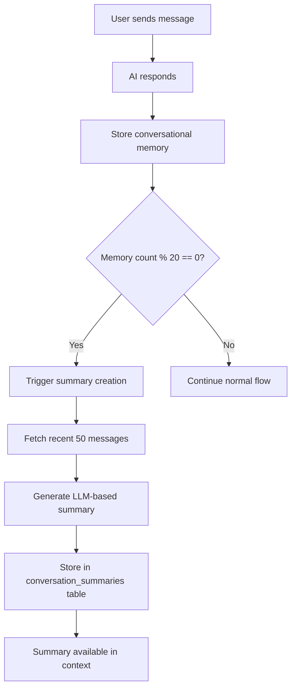

# Conversation Summaries Implementation

## Overview

The conversation summaries system automatically creates intelligent summaries of chat conversations to improve long-term context retention in your RAG pipeline. When conversations become lengthy, summaries capture key information without losing important details mentioned earlier.

## When Summaries Are Created

### **Automatic Triggers**

Conversation summaries are created automatically when:

1. **Every 20 conversational turns** (10 user messages + 10 AI responses)
2. **Triggered after successful memory storage** in the main API flow
3. **Background processing** - doesn't block the chat response

### **Manual Triggers**

You can also create summaries manually:

```typescript
import { contextManager } from '@/lib/context/ContextManager';

// Create summary for a specific chat
await contextManager.updateSummary(chatId, userId, clientId);
```

## How It Works

### **1. Summary Generation Process**



### **2. LLM-Based Summarization**

The system uses **GPT-4o-mini** to generate intelligent summaries that capture:

- ✅ **Main topics discussed**
- ✅ **Key decisions or conclusions reached**
- ✅ **Important details** (names, dates, addresses, etc.)
- ✅ **Action items or next steps**
- ✅ **Overall context and purpose**

**Fallback**: If OpenAI is unavailable, falls back to basic structural summary.

### **3. Database Schema**

```sql
CREATE TABLE conversation_summaries (
  id uuid PRIMARY KEY DEFAULT gen_random_uuid(),
  chat_id uuid NOT NULL REFERENCES "Chat"(id) ON DELETE CASCADE,
  user_id uuid NOT NULL REFERENCES "User"(id) ON DELETE CASCADE,
  summary_text text NOT NULL,
  messages_covered_start timestamp with time zone NOT NULL,
  messages_covered_end timestamp with time zone NOT NULL,
  created_at timestamp with time zone DEFAULT now(),
  client_id text NOT NULL REFERENCES "Clients"(id)
);
```

## Integration with RAG System

### **Context Window Construction**

When building context for AI responses, summaries are automatically included:

```typescript
const contextWindow = await contextManager.buildContextWindow(chatId, userId, clientId);

// Context includes:
// - recentHistory: Recent messages (15 latest)
// - keyEntities: Tracked entities
// - summary: Latest conversation summary ← NEW
// - files: Referenced documents
```

### **Layered Context Approach**

Your RAG system now uses a **3-layer context strategy**:

```
┌─────────────────────────────────────┐
│           Current Query             │
└─────────────────────────────────────┘
                   ↓
┌─────────────────────────────────────┐
│        Recent Messages (15)        │ ← Immediate context
└─────────────────────────────────────┘
                   ↓  
┌─────────────────────────────────────┐
│      Conversation Summary           │ ← Historical context
└─────────────────────────────────────┘
                   ↓
┌─────────────────────────────────────┐
│    External RAG Documents          │ ← Knowledge base
└─────────────────────────────────────┘
```

## Configuration Options

### **Summary Frequency**

Current default: **Every 20 turns** (10 exchanges)

To modify, edit the trigger condition in `app/api/brain/route.ts`:

```typescript
// Current: Create summary every 20 turns
if (memoryCount > 0 && memoryCount % 20 === 0) {

// Examples:
// More frequent: if (memoryCount > 0 && memoryCount % 10 === 0) 
// Less frequent: if (memoryCount > 0 && memoryCount % 40 === 0)
```

### **Summary Length**

Current default: **500 tokens max**

To modify, edit `lib/context/ContextManager.ts`:

```typescript
const llm = new ChatOpenAI({
  modelName: 'gpt-4o-mini',
  temperature: 0.3,
  maxTokens: 500, // ← Change this value
  openAIApiKey: process.env.OPENAI_API_KEY,
});
```

### **Message Coverage**

Current default: **50 recent messages**

To modify the summarization scope:

```typescript
// In updateSummary() method
const messagesToSummarize = await db
  .select()
  .from(message)
  .where(and(eq(message.chatId, chatId), eq(message.clientId, clientId)))
  .orderBy(desc(message.createdAt))
  .limit(50); // ← Change this value
```

## Testing & Verification

### **Test Script**

Run the test script to verify summary functionality:

```bash
npx tsx scripts/test-conversation-summary.ts
```

This will:
1. Find a chat with sufficient messages
2. Create a new summary
3. Verify the summary was stored
4. Test context window integration

### **Manual Testing**

1. **Create a long conversation** (20+ exchanges)
2. **Check the logs** for summary creation messages:
   ```
   [Brain API] Triggering summary creation for chat abc123 (20 turns stored)
   [Brain API] Successfully created summary for chat abc123
   ```
3. **Query the database**:
   ```sql
   SELECT * FROM conversation_summaries ORDER BY created_at DESC LIMIT 5;
   ```

## Monitoring & Logs

### **Key Log Messages**

- `[Brain API] Triggering summary creation` - Summary process started
- `[Brain API] Successfully created summary` - Summary completed
- `[ContextManager] Generated LLM summary` - Successful LLM summarization
- `[ContextManager] Falling back to basic summary` - LLM unavailable

### **Performance Monitoring**

The system logs:
- **Summary generation time** 
- **Summary length** (character count)
- **Message coverage** (start/end timestamps)
- **Fallback usage** (when LLM fails)

## Troubleshooting

### **Summaries Not Being Created**

1. **Check memory storage**: Ensure `storeConversationalMemory()` is working
2. **Verify turn count**: Check if conversations have reached 20 turns
3. **OpenAI API key**: Ensure `OPENAI_API_KEY` is configured
4. **Check logs**: Look for error messages in summary creation

### **Empty Summaries Table**

If your `conversation_summaries` table is empty:

1. **Verify the trigger logic** is working (check logs)
2. **Ensure conversations are long enough** (20+ turns)
3. **Check if summary creation is failing** (error logs)
4. **Run the test script** to manually trigger summary creation

### **LLM Summarization Failing**

If LLM summarization consistently fails:

1. **Check OpenAI API quotas/rate limits**
2. **Verify API key permissions** 
3. **Review message formatting** for edge cases
4. **Fallback to basic summaries** will automatically occur

## Future Enhancements

### **Planned Features**

- **Summary chaining** for very long conversations
- **Semantic similarity** between summaries and current queries  
- **Summary refresh** when significant new topics emerge
- **Multi-model support** (Claude, local models)
- **Summary quality scoring** and improvement

### **Integration Opportunities**

- **Conversation categorization** based on summary content
- **Automatic tagging** of important conversations
- **Cross-conversation insights** using summary analysis
- **Knowledge graph construction** from conversation summaries

## Architecture Benefits

This implementation provides:

- ✅ **Automatic operation** - no manual intervention required
- ✅ **Graceful degradation** - fallbacks when LLM unavailable
- ✅ **Non-blocking** - doesn't slow down chat responses  
- ✅ **Cascade delete** - cleans up when chats are deleted
- ✅ **Context integration** - seamlessly works with existing RAG
- ✅ **Monitoring** - comprehensive logging for debugging

The conversation summaries system ensures your AI maintains awareness of important details mentioned throughout long conversations, solving the original context loss problem while maintaining system performance and reliability. 