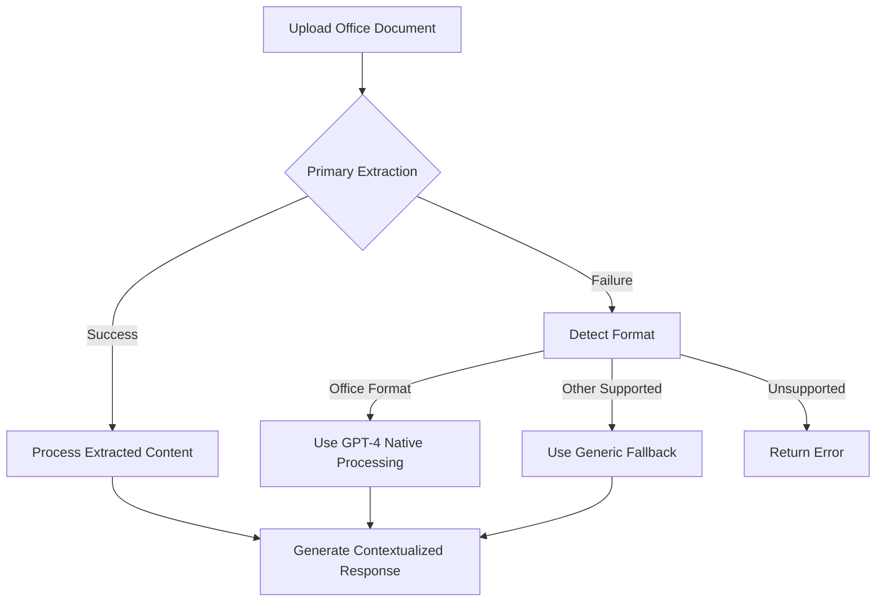

# Quibit RAG

A modular, enterprise-grade Retrieval-Augmented Generation (RAG) system with native file handling, Google Drive integration, and a modern Vercel-hosted chatbot interface.


## 🌟 Overview

Quibit RAG is an advanced AI assistant platform that combines modern language models with retrieval techniques to provide accurate, context-aware responses. Built on Next.js and deployed on Vercel, it offers enterprise-grade features including:

- **Robust Document Processing**: Support for Microsoft Office formats, PDFs, and more with intelligent fallback extraction
- **Google Drive Integration**: Seamless access to your organization's knowledge base
- **Vector Search**: Semantic document retrieval using Supabase's vector storage
- **Tool Integration**: Weather, web search, Google Calendar, and other tools
- **Modern UI**: Responsive interface with real-time streaming responses
- **Multi-model Support**: Dynamic LLM selection based on use cases
- **Multi-user Capabilities**: Authentication and permission management

## ✨ Key Features in v1.6.0

### Improved Chat Experience

- **Global Chat Pane**: Dedicated chat interface that works alongside document editing
- **New Chat Button**: Quick access to start fresh conversations in the global chat
- **Enhanced Message Handling**: Fixed duplicate messages and improved sidebar history
- **Better Error Handling**: Focused error toast notifications for a cleaner UX

### Enhanced Document System

- **Document Editor Improvements**: Stability enhancements and bug fixes
- **Real-time Collaboration**: Better synchronization between editor instances
- **Simplified UI**: Reduced notification noise with console-based logging instead of toasts
- **Comprehensive Debug Tools**: New debugging panel and testing endpoints

### UI and Performance Enhancements

- **Streamlined Interface**: Cleaner UX with reduced toast notifications
- **Better Navigation**: Fixed orchestration links and navigation between chat contexts
- **Performance Optimization**: Improved caching and reduced redundant API calls
- **Better Mobile Experience**: Enhanced responsive design for all screen sizes

## ✨ Key Features in v1.7.4

### Context Tracking & Specialist Message Retrieval
- **Improved Global Chat Context:** The global chat now accurately tracks and retrieves the most recent and relevant messages from specialist Bits (e.g., Echo Tango), even when users ask for the "most recent" or "last" message.
- **Message Deduplication & Cleaning:** Enhanced logic to deduplicate, clean, and format messages, eliminating garbled or repeated content in specialist responses.
- **Chronological Sorting:** Ensures that message history is always presented in the correct order, with clear identification of the latest message.
- **Prompt & Tooling Enhancements:** Updated orchestrator prompts and tool usage to better handle specialist context and user intent for message queries.

## ✨ Key Features in v1.7.9

### [PLACEHOLDER: Add highlights for v1.7.9]
- 
- 
- 

## 🏗️ Architecture

Quibit RAG follows a modular architecture with these key components:

### Client Layer
- Next.js front-end with React components
- AI SDK integration for streaming responses
- SWR for data fetching and state management
- Modern UI with Tailwind CSS

### API Layer
- RESTful endpoints for chat, brain, and file operations
- Authentication via NextAuth
- Streaming response support
- File upload and processing

### Brain Orchestration
- LangChain agent-based orchestration
- Tool integration for external services
- Context management for conversations
- Dynamic model selection

### Data Layer
- PostgreSQL for structured data
- Supabase for vector storage
- Vercel Blob for file storage
- Google Drive API integration

## 🚀 Getting Started

### Prerequisites
- Node.js (v18+)
- PostgreSQL database
- Supabase account for vector storage
- OpenAI API key
- Google API credentials
- n8n instance (optional for advanced extraction)

### Installation

1. Clone the repository:
```bash
git clone https://github.com/quibitai/Quibit_RAG.git
cd Quibit_RAG
```

2. Install dependencies:
```bash
npm install
# or
pnpm install
```

3. Set up environment variables:
```bash
cp .env.example .env.local
```

4. Configure essential environment variables in `.env.local`:
```
OPENAI_API_KEY=your_openai_api_key
NEXT_PUBLIC_SUPABASE_URL=your_supabase_url
SUPABASE_SERVICE_ROLE_KEY=your_supabase_key
POSTGRES_URL=your_postgres_connection_string
NEXTAUTH_URL=http://localhost:3000
NEXTAUTH_SECRET=your_secure_secret

# Optional n8n configuration
N8N_EXTRACT_WEBHOOK_URL=your_n8n_webhook_url
N8N_EXTRACT_AUTH_TOKEN=your_n8n_auth_token
```

5. Run database migrations:
```bash
npm run db:migrate
```

6. Start the development server:
```bash
npm run dev
```

Access the application at http://localhost:3000

## 📂 File Processing Capabilities

Quibit RAG offers advanced file processing with a multi-tiered approach:

1. **Primary Extraction (n8n)**: Uses n8n workflows for optimal extraction
2. **Fallback Extraction**: Intelligent fallback when primary extraction fails
3. **Format-Specific Handling**: Special processing for different file types:
   - Microsoft Office documents (DOCX, XLSX, PPTX)
   - PDF files
   - Plain text and markdown
   - JSON and structured data
   - Images and other binary formats

### Office Document Processing

The system leverages GPT-4's native ability to understand Microsoft Office formats:



## 🧩 Core Components

### Message Handling System

The system uses a robust message handling architecture:

- Type-safe content validation
- Race condition prevention
- Error handling and logging
- Support for various message types
- Attachment processing
- Streaming responses

### Brain API

The central intelligence orchestration:

- LangChain agent integration
- Tool management and execution
- Context window optimization
- Dynamic model selection
- Conversation history management
- File context incorporation

### Tool Integration

Quibit RAG includes several AI tools:

- Google Drive document search and retrieval
- Semantic search over vector database
- Weather information retrieval
- Web search via Tavily
- Google Calendar operations
- File extraction and processing

## 🧪 Development

### Running Tests
```bash
npm test
```

### Database Operations
```bash
# Run migrations
npm run db:migrate

# Generate new migration
npm run db:generate
```

### Environment Setup

For detailed environment setup, see the `.env.example` file and [environment setup documentation](./docs/ENVIRONMENT.md).

## 🤝 Contributing

We welcome contributions! Please see [CONTRIBUTING.md](./CONTRIBUTING.md) for guidelines.

## 📄 License

MIT

## 📚 Documentation

- [Architecture Overview](./ARCHITECTURE.md)
- [Environment Setup](./docs/ENVIRONMENT.md)
- [Database Schema](./docs/DATABASE.md)
- [Tool Integration](./docs/TOOLS.md)
- [Deployment Guide](./docs/DEPLOYMENT.md)

## Document Editor Debugging

We've added several debugging tools to help diagnose and fix issues with the document editor component:

1. **Debug Documentation**:
   - `docs/document-editor-issues.md` - Overview of issues and solutions
   - `docs/debugging.md` - Guide to debugging tools and procedures

2. **Test APIs**:
   - `/api/ping` - Simple endpoint to test API connectivity
   - `/api/documents/stream-test` - Test endpoint for document streaming

3. **Debug Panel**:
   - Access via `?debug=true` query parameter on any document page
   - Automatically enabled in development environment
   - Provides real-time monitoring of document events and API connectivity testing

4. **Utility Functions**:
   - `utils/test-document-functionality.ts` - Testing and debugging utilities
   - `utils/document-sync-validator.ts` - Content validation and sanitization

See the debugging documentation for more details on using these tools.
