# Quibit RAG

> A modular, enterprise-grade Retrieval-Augmented Generation (RAG) system with native file handling, Google Drive integration, and modern chatbot interface

**Status**: Stable  
**Last Updated**: 2025-01-28  
**Version**: 2.8.0


## Table of Contents
- [Overview](#overview)
- [Key Features](#key-features)
- [Architecture](#architecture)
- [Getting Started](#getting-started)
- [File Processing](#file-processing)
- [Development](#development)
- [Documentation](#documentation)
- [Contributing](#contributing)
- [License](#license)

## Overview

Quibit RAG is a modular, multi-tenant AI assistant platform that combines modern language models with retrieval techniques and a robust tool registry. Built on Next.js, LangChain, and Supabase, it's designed for extensibility, maintainability, and real-time streaming.

### Core Capabilities
- **Client-Aware Configuration**: Each client receives unique, context-aware experiences with custom prompts, tool access, and specialist personas
- **Advanced Context Management**: Automatic entity extraction, conversation summarization, conversational memory, and long-term context retention
- **Modular Tool Registry**: Easily add, remove, or update tools for document search, file handling, calendar, web search, and more
- **Real-time Streaming**: Server-Sent Events (SSE) for responsive chat and document updates
- **Multi-tenancy**: Client-aware context, permissions, and data isolation
- **Cross-Platform Integration**: Google Drive, Supabase, Tavily, Google Calendar, Asana, and more

### System Components
- **Brain Orchestrator**: Central LangChain agent for AI interactions
- **Specialist Registry**: Contextual AI personas (General Chat, Echo Tango, custom specialists)
- **Context Engine**: Advanced conversation memory, entity tracking, and intelligent summarization
- **Tool Framework**: Modular integrations with external services
- **Document Editor**: Real-time collaborative document creation
- **File Processing**: Intelligent extraction and analysis pipeline

## Key Features

### Version 2.8.0 Features (Latest)
- **Critical Asana GID Handling**: Comprehensive fix for all GID-related API errors across task updates, subtask creation, and project filtering
- **Enhanced Error Recovery**: Advanced user-friendly error handling with 15 comprehensive test cases and intelligent retry logic
- **API Constraint Compliance**: Fixed Asana API filtering constraints with proper parameter prioritization
- **LLM Tool Selection Roadmap**: Strategic 4-phase implementation plan for next-generation intelligent tool routing
- **Improved User Experience**: Seamless Asana operations with clear, actionable error guidance when issues occur
- **Robust Testing Infrastructure**: Expanded test coverage for all error scenarios and edge cases

### Version 2.7.0 Features
- **Modern Asana Tool Architecture**: Next-generation Asana integration using LLM function calling instead of regex-based intent parsing
- **Structured Function Schemas**: Comprehensive Zod-based schemas for 17+ Asana operations with type safety
- **LLM-Based Intent Extraction**: OpenAI-powered natural language understanding for flexible intent classification
- **Enhanced Context Awareness**: Improved conversation context handling for better task and project references

### Version 2.6.0 Features
- **Collapsed Artifacts Context Awareness**: AI now maintains full awareness of collapsed artifacts when they are closed from the artifact pane
- **Enhanced Scrolling System**: Complete rebuild of scrolling functionality for both main chat and artifact pane with smart auto-scroll
- **Critical AI Context Fix**: Resolved AI losing awareness of document content after closing artifacts (hitting X button)
- **Improved User Experience**: Seamless interaction between collapsed artifacts and AI responses with proper chronological placement
- **Technical Architecture**: Enhanced Brain API context processing and rebuilt scrolling architecture with conflict prevention

### Version 2.5.0 Features
- **Vercel AI SDK Migration**: Complete migration from custom LangChain streaming to modern Vercel AI SDK patterns for artifacts
- **Enhanced Artifact Rendering**: Proper Markdown support with clickable hyperlinks and improved visual integration
- **Fixed Artifact Functionality**: Resolved critical issues with artifact close/collapse functionality and state management
- **Collapsed Artifact Display**: New inline collapsed artifacts in chat with smart content preview and expandable functionality
- **Modern Streaming Architecture**: Industry-standard streaming protocols with better error handling and performance
- **Improved User Experience**: Seamless artifact interactions, better visual feedback, and enhanced accessibility

### Version 2.4.0 Features
- **Complete Phase 2 Implementation**: Full native Asana integration with 100% API coverage
- **Advanced Task Management**: Complete task lifecycle support including dependencies, subtasks, and followers
- **Sophisticated Project Operations**: Project management, sections, task organization with GID resolution
- **Enhanced User Operations**: User lookup, assignment management, and workspace integration
- **Advanced Search & Filtering**: Comprehensive search capabilities across tasks, projects, and users
- **Intelligent Context Management**: Task context memory and cross-session awareness
- **Production-Ready Architecture**: Robust error handling, caching, and performance optimization

### Version 2.3.0 Features
- **Modular Asana Integration**: Complete rebuild of Asana tool with modular architecture, intent parsing, and comprehensive API coverage
- **Google Calendar Tool**: Dedicated Google Calendar integration (renamed from n8n MCP Gateway) for focused calendar management
- **Conversation Summaries System**: Automatic LLM-powered conversation summarization with long-term context retention
- **Enhanced Tool Architecture**: Improved modularity, error handling, and type safety across all tools
- **Comprehensive Documentation**: Updated documentation for all tools and architectural improvements

### Version 2.2.0 Features
- **Advanced Asana Operations**: Complete task management, project operations, and natural language processing
- **Tool Framework Improvements**: Enhanced error handling, timeout management, and response formatting
- **Performance Optimizations**: Improved caching strategies and API efficiency

### Version 2.1.0 Features
- **Comprehensive Context Management**: Advanced entity extraction, conversation summarization, and cross-chat context sharing
- **Enhanced Tool Integration**: Improved reliability and client-specific configurations
- **Background Processing**: Non-blocking entity extraction and context building
- **Improved Documentation**: Comprehensive API documentation and style guides

### Version 2.0.0 Foundation
- **Client-Aware Configuration System**: Dynamic prompts and tool access per client using unified configuration schema
- **General Chat Specialist**: Dedicated, client-contextualized specialist for standard chat contexts
- **Unified Specialist Registry**: Centralized management of all specialists with no UI duplicates
- **Comprehensive Test Suite**: Unit and integration tests for prompts, tools, and client context injection

## Architecture

Quibit RAG follows a modular, streaming architecture optimized for scalability and maintainability:

### High-Level Data Flow

```mermaid
graph TB
    %% User Interface Layer
    subgraph "🖥️ Frontend Layer"
        UI[React Chat Interface]
        MUI[Multimodal Input]
        AC[Artifact Canvas]
        GP[Global Chat Pane]
        FU[File Upload UI]
    end

    %% API Gateway Layer
    subgraph "🚪 API Gateway"
        BR["/api/brain"]
        FA["/api/files"]
        AU["/api/auth"]
    end

    %% Core Processing Engine
    subgraph "🧠 Brain Orchestrator"
        direction TB
        MP[Message Processor]
        LC[LangChain Agent]
        PS[Prompt Synthesizer]
        SM[Streaming Manager]
    end

    %% Context Management System
    subgraph "🎯 Context Engine"
        direction TB
        EE[Entity Extractor]
        CM[Conversational Memory]
        CS[Context Summarizer]
        CR[Context Retriever]
        FC[File Context Handler]
    end

    %% Tool Execution Framework
    subgraph "🔧 Tool Registry"
        direction TB
        TR[Tool Router]
        subgraph "Tools"
            AT[Asana Tool]
            GC[Google Calendar]
            TS[Tavily Search]
            DM[Document Manager]
            WE[Weather Tool]
        end
        TF[Tool Formatter]
    end

    %% Artifact Generation System
    subgraph "📄 Artifact System"
        direction TB
        AG[Artifact Generator]
        AS[Artifact Streamer]
        AR[Artifact Renderer]
        subgraph "Artifact Types"
            TA[Text/Markdown]
            CA[Code Artifacts]
            SA[Spreadsheets]
            IA[Images]
        end
    end

    %% Data Persistence Layer
    subgraph "💾 Database Layer"
        direction TB
        PG[(PostgreSQL/Supabase)]
        VDB[(Vector Store)]
        BL[(Vercel Blob)]
        subgraph "Tables"
            CH[Chat History]
            UM[User Messages]
            AM[AI Messages]
            DS[Document Store]
            EN[Entities]
            CV[Conversations]
            AR_DB[Artifacts]
        end
    end

    %% File Processing Pipeline
    subgraph "📁 File Processing"
        direction TB
        FP[File Processor]
        CE[Content Extractor]
        EM[Embedding Generator]
        FM[File Metadata]
        subgraph "Extraction Types"
            PDF[PDF Extraction]
            DOC[DOCX/Office]
            IMG[Image OCR]
            CODE[Code Analysis]
        end
    end

    %% External Services
    subgraph "🌐 External APIs"
        direction TB
        OAI[OpenAI GPT-4]
        ASA[Asana API]
        GCA[Google Calendar]
        TAV[Tavily Search]
        N8N[n8n Workflows]
    end

    %% User Interaction Flow
    UI -->|User Input| MUI
    MUI -->|Process Message| BR
    UI -->|File Upload| FU
    FU -->|Upload Files| FA

    %% Main Processing Flow
    BR -->|Route Request| MP
    MP -->|Extract Context| EE
    MP -->|Retrieve Memory| CR
    MP -->|Process Message| LC
    
    %% Context Management Flow
    EE -->|Store Entities| EN
    CR -->|Query Vector DB| VDB
    CM -->|Update Memory| VDB
    CS -->|Summarize| OAI
    FC -->|File References| DS

    %% LangChain Agent Processing
    LC -->|Synthesize Prompt| PS
    PS -->|Query LLM| OAI
    LC -->|Route Tools| TR
    LC -->|Generate Artifacts| AG

    %% Tool Execution Flow
    TR -->|Execute Tools| AT
    TR -->|Execute Tools| GC
    TR -->|Execute Tools| TS
    TR -->|Execute Tools| DM
    AT -->|API Calls| ASA
    GC -->|API Calls| GCA
    TS -->|API Calls| TAV
    DM -->|Query DB| PG
    
    %% Tool Response Processing
    AT -->|Format Response| TF
    GC -->|Format Response| TF
    TS -->|Format Response| TF
    DM -->|Format Response| TF
    TF -->|Return to Agent| LC

    %% Artifact Generation Flow
    AG -->|Create Artifact| AS
    AS -->|Stream Content| SM
    AS -->|Store Artifact| AR_DB
    AR -->|Render UI| AC

    %% Streaming Response Flow
    SM -->|SSE Stream| UI
    SM -->|Update Context| CM
    SM -->|Save Messages| UM
    SM -->|Save Messages| AM

    %% File Processing Flow
    FA -->|Process Files| FP
    FP -->|Extract Content| CE
    CE -->|PDF Processing| PDF
    CE -->|Office Docs| DOC
    CE -->|Image OCR| IMG
    CE -->|Code Analysis| CODE
    CE -->|Generate Embeddings| EM
    EM -->|Store Vectors| VDB
    FP -->|Store Metadata| FM
    FM -->|Save to DB| DS

    %% Database Operations
    MP -->|Save Chat| CH
    LC -->|Save Conversations| CV
    EE -->|Store Entities| EN
    
    %% External API Integrations
    N8N -->|Webhook Responses| GC
    N8N -->|File Processing| CE

    %% Response Flow Back to UI
    PG -->|Query Results| DM
    VDB -->|Search Results| CR
    BL -->|File Access| FA
    AC -->|Display Artifacts| UI
    GP -->|Global Context| BR

    %% Styling
    classDef frontend fill:#e1f5fe
    classDef api fill:#f3e5f5
    classDef brain fill:#fff3e0
    classDef context fill:#e8f5e8
    classDef tools fill:#fff8e1
    classDef artifacts fill:#fce4ec
    classDef database fill:#e3f2fd
    classDef files fill:#f1f8e9
    classDef external fill:#ffebee

    class UI,MUI,AC,GP,FU frontend
    class BR,FA,AU api
    class MP,LC,PS,SM brain
    class EE,CM,CS,CR,FC context
    class TR,AT,GC,TS,DM,WE,TF tools
    class AG,AS,AR,TA,CA,SA,IA artifacts
    class PG,VDB,BL,CH,UM,AM,DS,EN,CV,AR_DB database
    class FP,CE,EM,FM,PDF,DOC,IMG,CODE files
    class OAI,ASA,GCA,TAV,N8N external
```



### Key Components

#### 🧠 **Brain API** (`/api/brain`)
- Central orchestration endpoint using LangChain agents
- Dynamic tool selection based on context and permissions
- Real-time SSE streaming with structured data
- Context-aware prompt composition

#### 🔧 **Tool Registry** (`/lib/ai/tools/`)
- Modular, self-contained tool implementations
- Direct API integrations (Google Drive, Supabase, Tavily, etc.)
- Client-specific configuration support
- Unified error handling and logging

#### 🎯 **Context Manager** (`/lib/context/`)
- Automatic entity extraction (addresses, dates, names, etc.)
- Intelligent conversation summarization using GPT-4o-mini
- Conversational memory with vector-based retrieval  
- File reference tracking and metadata storage
- Cross-chat context sharing
- Background processing for optimal performance

#### 📊 **Data Layer**
- PostgreSQL (Supabase) for structured and vector data
- Vercel Blob for file storage
- Row-level security (RLS) for multi-tenancy
- Real-time subscriptions

## Getting Started

### Prerequisites
- **Node.js** (v18+)
- **pnpm** (9.12.3) - Required package manager
- **PostgreSQL** database (Supabase recommended)
- **OpenAI API key**
- **Google API credentials** (optional, for Drive integration)

### Quick Installation

1. **Clone and install dependencies:**
```bash
git clone https://github.com/quibitai/Quibit_RAG.git
cd Quibit_RAG
pnpm install
```

2. **Environment configuration:**
```bash
cp .env.example .env.local
```

3. **Configure essential environment variables:**
```env
# Core Configuration
OPENAI_API_KEY=your_openai_api_key
NEXTAUTH_URL=http://localhost:3000
NEXTAUTH_SECRET=your_secure_secret

# Database
NEXT_PUBLIC_SUPABASE_URL=your_supabase_url
SUPABASE_SERVICE_ROLE_KEY=your_supabase_key
POSTGRES_URL=your_postgres_connection_string

# Optional Integrations
N8N_EXTRACT_WEBHOOK_URL=your_n8n_webhook_url
N8N_EXTRACT_AUTH_TOKEN=your_n8n_auth_token
TAVILY_API_KEY=your_tavily_api_key
```

4. **Database setup:**
```bash
pnpm db:migrate
```

5. **Start development server:**
```bash
pnpm dev
```

Access the application at [http://localhost:3000](http://localhost:3000)

### Docker Setup (Alternative)

```bash
# Using Docker Compose
docker-compose up -d

# Using individual containers
docker build -t quibit-rag .
docker run -p 3000:3000 quibit-rag
```

## File Processing

### Supported Formats
- **Documents**: PDF, DOCX, TXT, MD, JSON
- **Spreadsheets**: XLSX, CSV
- **Images**: PNG, JPG, GIF (with OCR)
- **Code**: JS, TS, PY, and more

### Processing Pipeline
1. **Upload**: Files stored in Vercel Blob
2. **Extraction**: n8n workflow for content extraction
3. **Analysis**: LLM-powered content understanding
4. **Storage**: Metadata and content stored in database
5. **Context Integration**: Automatic reference tracking

### Advanced Features
- **Fallback Extraction**: LLM-based processing for unsupported formats
- **Microsoft Office Support**: Native GPT-4 document processing
- **Multi-modal Support**: Text, images, and structured data
- **Version Tracking**: File update history and diff tracking

## Development

### Development Commands
```bash
# Development
pnpm dev              # Start development server with Turbo
pnpm build           # Build for production
pnpm start           # Start production server

# Code Quality
pnpm lint            # Run ESLint and Biome
pnpm lint:fix        # Fix linting issues
pnpm format          # Format code with Biome

# Database
pnpm db:generate     # Generate migrations
pnpm db:migrate      # Run migrations
pnpm db:studio       # Open Drizzle Studio

# Testing
pnpm test            # Run Playwright tests
```

### Project Structure
```
├── app/                    # Next.js App Router
│   ├── api/               # API routes
│   │   ├── brain/         # Main AI endpoint
│   │   └── files/         # File handling
│   └── (auth)/            # Authentication
├── lib/                   # Core libraries
│   ├── ai/               # AI and tool logic
│   ├── context/          # Context management
│   ├── db/               # Database schema
│   └── utils/            # Utilities
├── components/           # React components
├── docs/                # Documentation
└── tests/              # Test suites
```

### Code Standards
- **File Size**: Maximum 200 lines per file for maintainability
- **Documentation**: JSDoc comments for all public functions
- **Testing**: Unit and integration tests required
- **Type Safety**: Strict TypeScript configuration
- **Code Style**: Biome for formatting and linting

## Documentation

### Complete Documentation
- **[API Reference](./docs/api/)** - Complete endpoint documentation
- **[Architecture Guide](./ARCHITECTURE.md)** - System design and decisions
- **[Prompt System](./docs/prompt-architecture-guide.md)** - Configuration and customization
- **[Development Guide](./docs/guides/)** - Setup and development workflow
- **[Style Guide](./DOCUMENTATION_STYLE_GUIDE.md)** - Documentation standards

### Key Guides
- **[Message Handling](./docs/MESSAGE_HANDLING.md)** - LangChain message processing
- **[Context Management](./docs/planning/context-management-plan.md)** - Advanced context features
- **[Tool Development](./docs/guides/tool-development.md)** - Creating custom tools
- **[Client Configuration](./docs/configuration-json-guide.md)** - Multi-tenant setup
- **[Debugging](./docs/debugging.md)** - Troubleshooting and diagnostics

### Testing Documentation
- **[Test Overview](./tests/prompts/README.md)** - Testing strategy and setup
- **[E2E Testing](./docs/guides/e2e-testing.md)** - End-to-end test setup
- **[Performance Testing](./docs/guides/performance.md)** - Load and performance testing

## Contributing

We welcome contributions! Please read our guidelines:

1. **[Contributing Guide](./CONTRIBUTING.md)** - Detailed contribution process
2. **[Code of Conduct](./CODE_OF_CONDUCT.md)** - Community standards
3. **[Development Guide](./docs/guides/development.md)** - Local setup and workflow
4. **[Style Guide](./DOCUMENTATION_STYLE_GUIDE.md)** - Documentation standards

### Quick Start for Contributors
```bash
# Fork and clone the repository
git clone https://github.com/YOUR_USERNAME/Quibit_RAG.git
cd Quibit_RAG

# Create feature branch
git checkout -b feature/amazing-feature

# Install dependencies
pnpm install

# Make changes and test
pnpm lint
pnpm test

# Commit and push
git commit -m "Add amazing feature"
git push origin feature/amazing-feature
```

## License

This project is licensed under the MIT License - see the [LICENSE](./LICENSE) file for details.

## Support

- **GitHub Issues**: [Report bugs and request features](https://github.com/quibitai/Quibit_RAG/issues)
- **Documentation**: [Complete documentation portal](./docs/)
- **Community**: [Discussions and support](https://github.com/quibitai/Quibit_RAG/discussions)

---

**Built with ❤️ by the Quibit Team**  
**Last Updated**: 2025-01-28  
**Version**: 2.8.0
