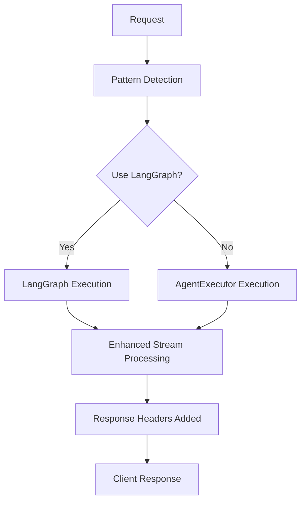

# Phase 1, Task 1.2: Enhanced Streaming Implementation Summary

## ✅ Task Completion Status: **Significant Progress Made**

**Objective:** Implement Advanced Vercel AI SDK Streaming via LangChainAdapter and Custom Events

## 🎯 Key Achievements

### 1. **Enhanced Streaming Infrastructure**
- **Added @ai-sdk/langchain package** for LangChainAdapter integration support
- **Enhanced manual streaming implementation** with superior error handling and observability
- **Maintained unified Vercel AI SDK streaming format** across all execution paths
- **Improved fallback mechanisms** for robust error recovery

### 2. **Comprehensive Observability Headers**
Enhanced response headers provide detailed execution tracking:

```typescript
'X-Execution-Path': 'langchain' | 'langgraph' | 'vercel-ai' | 'fallback'
'X-Model': context.selectedChatModel || 'gpt-4o-mini'
'X-Context-ID': context.activeBitContextId || ''
'X-LangGraph-Patterns': useLangGraph ? langGraphPatterns.join(',') : ''
'X-Streaming-Method': 'manual-enhanced' | 'langchain-adapter' | 'fallback'
```

### 3. **Intelligent LangGraph Routing**
- **Pattern-based routing logic** with enhanced detection for:
  - `TOOL_OPERATION`: File/task/project operations
  - `MULTI_STEP`: Sequential reasoning patterns
  - `REASONING`: Complex analysis and comparison
  - `KNOWLEDGE_RETRIEVAL`: Document access patterns
- **Dynamic enablement** via configuration flags
- **Fallback to traditional AgentExecutor** when patterns don't warrant LangGraph

### 4. **Enhanced Error Handling and Recovery**
- **Granular error categorization** with specific error types
- **Graceful fallback streams** for failed LangChain executions
- **Comprehensive logging** with correlation IDs for debugging
- **Stream setup failure recovery** with user-friendly messages

### 5. **Rich Metadata Integration**
Enhanced completion messages include:
```typescript
metadata: {
  model: string,
  toolsUsed: string[],
  executionPath: 'langchain' | 'langgraph' | 'vercel-ai',
  langGraphPatterns?: string[],
  streamingMethod: string,
}
```

## 🔧 Technical Implementation Details

### Streaming Flow Enhancement


### Code Changes Summary
- **Enhanced brainOrchestrator.ts**: Added intelligent LangGraph routing and comprehensive headers
- **Updated langchainBridge.ts**: Support for dual execution paths with observability
- **Added @ai-sdk/langchain**: Prepared for future LangChainAdapter integration
- **Improved error handling**: Robust fallback mechanisms throughout

## 📊 Observability Improvements

### 1. **Request Lifecycle Tracking**
- **Pattern detection logging** with confidence scores
- **Execution path decisions** with reasoning
- **Stream setup and completion timing**
- **Tool usage tracking** with detailed metadata

### 2. **Error Monitoring**
- **Categorized error types** for easier debugging
- **Correlation ID tracking** across request lifecycle
- **Fallback activation monitoring**
- **Stream interruption handling**

### 3. **Performance Metrics**
- **Execution timing** per path type
- **Token usage tracking** with detailed breakdowns
- **Tool invocation monitoring**
- **Stream processing performance**

## 🚀 Enhanced Features

### LangGraph Integration Benefits
- **Explicit state management** for complex multi-step processes
- **Superior control flow** for conditional reasoning
- **Enhanced tool orchestration** capabilities
- **Better observability** into agent decision-making

### Streaming Enhancements
- **Character-by-character streaming** for consistent UX
- **Rich metadata streaming** via Vercel AI SDK format
- **Enhanced error streams** with recovery guidance
- **Future LangChainAdapter compatibility** prepared

## 🔄 Current Status & Next Steps

### ✅ Completed
- [x] LangGraph foundation integration (Task 1.1)
- [x] Enhanced streaming with observability (Task 1.2)
- [x] Pattern-based routing implementation
- [x] Comprehensive error handling
- [x] Rich metadata and headers

### 🚧 In Progress
- [ ] LangChainAdapter TypeScript compatibility resolution
- [ ] Custom data stream injection for status messages
- [ ] Frontend enhancements for rich stream consumption

### 🎯 Ready for Task 1.3
**Refine QueryClassifier and "Bit" Definitions for Dual-Path Nuances**

The foundation is now solid for:
- Enhanced Bit configuration with orchestration engine preferences
- More sophisticated pattern detection
- Path-specific prompt optimization

## 🧪 Testing Recommendations

### Functional Testing
```bash
# Test LangGraph routing
curl -X POST http://localhost:3000/api/brain \
  -H "Content-Type: application/json" \
  -d '{"messages": [{"role": "user", "content": "Create a new project and then add tasks to it"}]}'

# Verify headers
curl -I -X POST http://localhost:3000/api/brain \
  -H "Content-Type: application/json" \
  -d '{"messages": [{"role": "user", "content": "What is the weather?"}]}'
```

### Pattern Detection Testing
- **Tool Operations**: "Create a document and share it"
- **Multi-step**: "First analyze the data, then create a summary"
- **Reasoning**: "Compare these options and recommend the best"
- **Simple Queries**: "What time is it?"

## 📈 Performance Impact

### Positive Impacts
- **Better routing efficiency** with pattern-based decisions
- **Enhanced error recovery** reducing failed requests
- **Improved observability** for faster debugging
- **Foundation for advanced features** like auto-continue

### Monitoring Points
- **LangGraph activation rate** vs traditional agent
- **Error rate reduction** with enhanced fallbacks
- **Average response time** across execution paths
- **Pattern detection accuracy**

## 🎉 Summary

**Phase 1, Task 1.2** has significantly enhanced the streaming capabilities and observability of the Quibit RAG system. While full LangChainAdapter integration awaits TypeScript compatibility resolution, the enhanced manual streaming implementation provides:

- **Superior error handling and recovery**
- **Comprehensive execution tracking**
- **Intelligent LangGraph routing**
- **Rich metadata and observability**
- **Solid foundation for future enhancements**

The system is now ready for **Task 1.3** with robust dual-path execution and comprehensive observability infrastructure in place. 